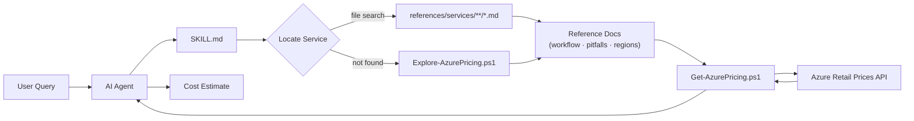

# Azure Cost Calculator — AI Agent Skill

An AI coding agent skill that estimates Azure resource costs using **live pricing data** from the [Azure Retail Prices API](https://learn.microsoft.com/en-us/rest/api/cost-management/retail-prices/azure-retail-prices). Compatible with [GitHub Copilot](https://docs.github.com/en/copilot/customizing-copilot/copilot-extensions/building-copilot-skills), [Claude Code](https://claude.ai), [Cursor](https://cursor.sh), [Windsurf](https://windsurf.com), and other agents that support the [skills.sh](https://skills.sh) ecosystem.

No guessing, no stale spreadsheets — just real-time price lookups and clear cost breakdowns.

## Supported Services (20+)

| Category        | Services                                                                                       |
| --------------- | ---------------------------------------------------------------------------------------------- |
| **Compute**     | Virtual Machines, App Service, Azure Functions, Container Apps, AKS, Container Registry        |
| **Databases**   | SQL Database, Cosmos DB, PostgreSQL Flexible Server, Redis Cache                               |
| **Storage**     | Blob / File / Queue / Table Storage, Managed Disks                                             |
| **Networking**  | Application Gateway, Load Balancer, Azure Firewall, Private Link, Private DNS, DDoS Protection |
| **Security**    | Key Vault, Defender for Cloud                                                                  |
| **Integration** | API Management, Service Bus                                                                    |
| **Monitoring**  | Application Insights / Azure Monitor                                                           |

## Installation

### Via skills.sh (any agent)

```bash
npx skills add ahmadabdalla/azure-cost-calculator-skill
```

### Via GitHub Copilot Chat

1. Open **GitHub Copilot Chat** in VS Code
2. Type: `install skill ahmadabdalla/azure-cost-calculator-skill`
3. The skill is now available in all Copilot Chat sessions

### Manual install

Add the skill to your VS Code settings or `.github/copilot-skills.yml`:

```yaml
skills:
  - repo: ahmadabdalla/azure-cost-calculator-skill
```

## Usage

Once installed, just ask Copilot about Azure costs in natural language. The skill automatically activates when it detects pricing-related questions.

### Example prompts

```
How much does a D4s v5 VM cost per month in East US?
```

```
Compare App Service pricing tiers for a production web app
```

```
Estimate the monthly cost of a Standard_B2s VM with a P30 managed disk in Australia East in AUD
```

```
What's the cost of a General Purpose SQL Database with 4 vCores in West Europe in EUR?
```

```
Budget a Kubernetes cluster with 3 D4s v5 nodes in Canada Central
```

```
How much would Azure Cosmos DB with 1000 RU/s and 100 GB storage cost?
```

### Sample interaction

**You:** _How much does a Standard_D4s_v5 VM cost per month in East US?_

**Copilot:** Queries the live Azure Retail Prices API and returns:

> **Azure VM Cost Estimate — Standard_D4s_v5 (East US)**
>
> | Item         | Value           |
> | ------------ | --------------- |
> | SKU          | Standard_D4s_v5 |
> | Region       | eastus          |
> | OS           | Linux           |
> | Unit Price   | $0.192 /hour    |
> | Monthly Cost | **$140.16**     |
>
> **Assumptions:** Pay-as-you-go pricing, Linux OS, 730 hours/month, no reserved instances.

## Architecture



## How It Works

The skill uses the **filesystem as an index** — each supported Azure service has a dedicated reference file under `.github/skills/azure-cost-calculator/references/services/` organized by category (compute, databases, networking, etc.). These files contain the exact API filter values, cost formulas, and known traps for each service.

1. **Identifies** the Azure resource type(s) from your question
2. **Locates** the matching service reference file via file search across `.github/skills/azure-cost-calculator/references/services/**/*.md`
3. **Reads** the service file for exact query parameters (`serviceName`, `productName`, `skuName`, `meterName`)
4. **Runs** `Get-AzurePricing.ps1` which calls the [Azure Retail Prices REST API](https://learn.microsoft.com/en-us/rest/api/cost-management/retail-prices/azure-retail-prices)
5. **Presents** a structured estimate with unit price, monthly cost, and stated assumptions

Shared reference docs provide additional guidance: [workflow.md](.github/skills/azure-cost-calculator/references/workflow.md) for script parameters, [pitfalls.md](.github/skills/azure-cost-calculator/references/pitfalls.md) for known traps, [regions-and-currencies.md](.github/skills/azure-cost-calculator/references/regions-and-currencies.md) for region names and currency conversion, and [reserved-instances.md](.github/skills/azure-cost-calculator/references/reserved-instances.md) for RI pricing traps.

For services **not yet documented**, `Explore-AzurePricing.ps1` discovers available filter values directly from the API.

All prices come directly from Microsoft's public API — no hardcoded values.

## Features

- **Live pricing** — always queries the Azure Retail Prices API at runtime
- **Multi-currency** — supports USD, AUD, EUR, GBP, JPY, CAD, INR, and more
- **All regions** — works with any Azure region
- **Comparison mode** — compare SKUs, tiers, or regions side-by-side
- **Transparent assumptions** — every estimate states region, OS, commitment type, and instance count
- **Exploration script** — includes `Explore-AzurePricing.ps1` for discovering available SKUs and pricing options

## Prerequisites

- **PowerShell 5.1+** (pre-installed on Windows; available on macOS/Linux via [PowerShell Core](https://learn.microsoft.com/en-us/powershell/scripting/install/installing-powershell))
- **Internet access** to reach `https://prices.azure.com`
- No Azure subscription or authentication required — the Retail Prices API is public

## Contributing

Contributions are welcome! If you'd like to add support for a new Azure service or improve an existing one:

1. Fork this repository
2. Add or update the service reference in `.github/skills/azure-cost-calculator/references/services/` (use [TEMPLATE.md](.github/skills/azure-cost-calculator/TEMPLATE.md) as a starting point)
3. Update the category index in [references/shared.md](.github/skills/azure-cost-calculator/references/shared.md) if adding a new category
4. Submit a pull request

## License

This project is licensed under the [MIT License](LICENSE).
