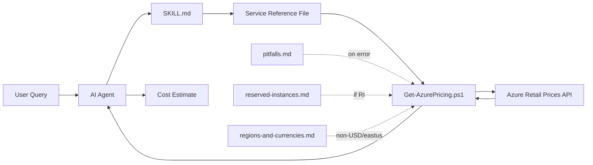

# Azure Cost Calculator — AI Agent Skill

Real-time Azure cost estimation using the public [Azure Retail Prices API](https://learn.microsoft.com/en-us/rest/api/cost-management/retail-prices/azure-retail-prices). Works with any agent in the [skills.sh](https://skills.sh) ecosystem. No guessing, no stale data — deterministic price lookups from the live API. No Azure subscription required.

## Install

```bash
npx skills add ahmadabdalla/azure-cost-calculator-skill
```

Or manually point your agent's config to `skills/azure-cost-calculator/SKILL.md` in this repo.

## Usage

Ask about Azure costs in natural language. The skill activates automatically.

```
How much does a D4s v5 VM cost per month in East US?
Compare App Service pricing tiers for a production web app
Estimate a Standard_B2s VM with a P30 managed disk in Australia East in AUD
What's the cost of a General Purpose SQL Database with 4 vCores in West Europe in EUR?
How much would Azure Cosmos DB with 1000 RU/s and 100 GB storage cost?
```

## How It Works

The skill uses service reference files as an index. Each file contains exact API filter values, cost formulas, and traps. The agent locates the right file, runs `Get-AzurePricing.ps1` against the live API, and presents a structured estimate.

- **Deterministic** — same query → same API call → same price. All values from the live API, nothing hardcoded.
- **Token-efficient** — only SKILL.md and shared.md load on every query. Service files load on demand. Batch mode (3+ services) reads only the first 45 lines per file.
- **Multi-currency, all regions** — supports USD, AUD, EUR, GBP, JPY, CAD, INR, etc. Works with any Azure region.



References load on demand — keeping token consumption low even for 10+ service estimates.

## Supported Services

140+ Azure services are mapped across 18 categories (Compute, Databases, Networking, Storage, Security, Monitoring, Integration, AI + ML, and more). ~25+ services have full reference files with documented query patterns. For services without reference files, `Explore-AzurePricing.ps1` discovers filter values directly from the API.

## Prerequisites

- PowerShell 5.1+ (pre-installed on Windows; [install on macOS/Linux](https://learn.microsoft.com/en-us/powershell/scripting/install/installing-powershell))
- Internet access to `https://prices.azure.com`
- No Azure subscription or authentication required

## Contributing

See [CONTRIBUTING.md](CONTRIBUTING.md) for the full guide. In short:

- Add service files under `skills/azure-cost-calculator/references/services/<category>/` using the [template](skills/azure-cost-calculator/references/services/TEMPLATE.md)
- First query pattern must appear within lines 1–45 (required for batch mode)
- Run the validation script before submitting: `pwsh skills/azure-cost-calculator/scripts/Validate-ServiceReference.ps1`

## License

This project is licensed under the [MIT License](LICENSE).
