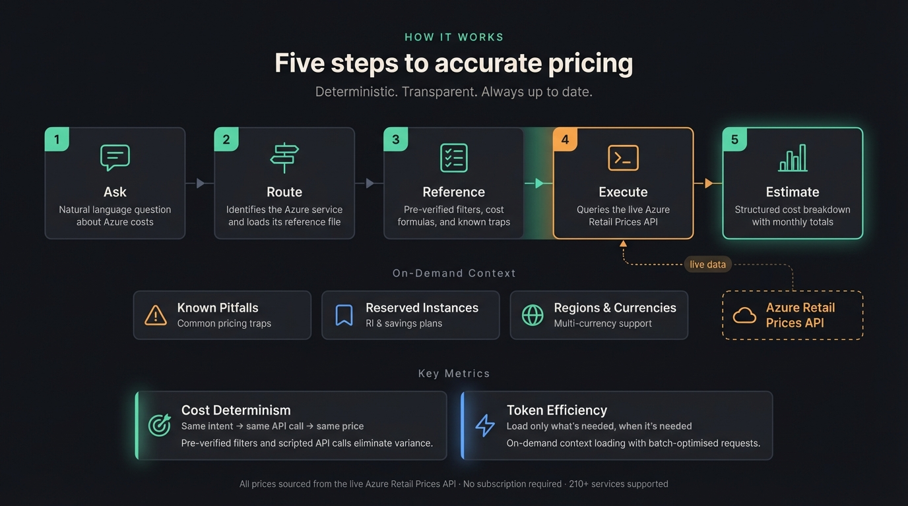

# Azure Cost Calculator - AI Agent Skill

Real-time Azure cost estimation using the public [Azure Retail Prices API](https://learn.microsoft.com/en-us/rest/api/cost-management/retail-prices/azure-retail-prices). Works with any agent in the [skills.sh](https://skills.sh) ecosystem. All prices come from live API lookups. No Azure subscription required.

## Install

```bash
npx skills add ahmadabdalla/azure-cost-calculator-skill
```

> **Don't have `npx`?** Install [Node.js](https://nodejs.org/) (which includes `npm` and `npx`), or run `npm install -g skills` first then use `skills add ahmadabdalla/azure-cost-calculator-skill`.

The CLI auto-detects your agent (Claude Code, Cursor, GitHub Copilot, Codex, etc.) and installs the skill to the correct directory.

## Usage

Ask about Azure costs in natural language. The skill activates automatically.

```
How much does a D4s v5 VM cost per month in East US?
Compare App Service pricing tiers for a production web app
Estimate a Standard_B2s VM with a P30 managed disk in Australia East in AUD
What's the cost of a General Purpose SQL Database with 4 vCores in West Europe in EUR?
How much would Azure Cosmos DB with 1000 RU/s and 100 GB storage cost?
```

**Planning a larger architecture?** Start with:

> _I'd like to perform a cost analysis on an Azure architecture. What do I need to consider to get consistent results?_

The agent will walk you through the key parameters that affect pricing accuracy. For the full guide on writing prompts that produce deterministic estimates, see the [Usage Guide](skills/azure-cost-calculator/USAGE.md).

## How It Works

The skill uses service reference files as an index. Each file contains exact API filter values as declarative `Key: Value` parameters, cost formulas, and traps. The agent reads the matching file, translates the parameters to the detected runtime (Bash or PowerShell), runs the pricing script against the live API, and presents a structured estimate.

The skill optimises for two goals:

- **Determinism** - target ≤ 5% cost variance. Same query → same API call → same price. All values from the live API, nothing hardcoded. LLMs are non-deterministic by nature, so this skill is designed to constrain them where possible: pre-verified filters, explicit formulas, and scripted API calls reduce the surface area where the model can drift.
- **Token efficiency** - target ≤ 5% token usage variance. Only SKILL.md and shared.md load on every query. Service files load on demand. Batch mode (3+ services) reads only the first 45 lines per file.

Other design goals:

- **Multi-currency, all regions** - supports USD, AUD, EUR, GBP, JPY, CAD, INR, etc. Works with any Azure region.

> **Note:** Targets measured via A/B testing with clean-context sessions against complex Azure architectures. Tested with **Claude Opus 4.6** and **Gemini Pro 3**. Results with other models may vary.

<p align="center">
  
</p>

References load on demand, keeping token usage low even for 10+ service estimates.

## Supported Services

210+ Azure services are mapped across 18 categories (Compute, Databases, Networking, Storage, Security, Monitoring, Integration, AI + ML, and more). 50+ services have full reference files with documented query patterns. For services without a reference file, the skill includes an exploration script that searches the live API to find the right filters automatically.

### With vs. Without a Service Reference File

The skill works for **any** Azure service, with or without a reference file. Reference files improve the result:

|                      | With reference file                                               | Without (discovery mode)                                                            |
| -------------------- | ----------------------------------------------------------------- | ----------------------------------------------------------------------------------- |
| **API query**        | Pre-verified filters                                              | Agent discovers filters from the live API                                           |
| **Known gotchas**    | Documented - the agent avoids common pricing quirks automatically | Agent still works, but may not catch edge cases like $0.00 rounding or RI math      |
| **Multi-part costs** | Each component (compute, storage, IP, etc.) has its own query     | Agent queries the main component; secondary costs may need a follow-up              |
| **Cost formula**     | Correct multipliers, free-tier deductions, tiered pricing         | Uses the API's unit of measure - usually right, occasionally off for unusual meters |
| **Speed**            | Fast - fewer tokens                                               | Slower - requires a discovery step first                                            |
| **Accuracy**         | High - patterns tested against the live API                       | Depends on model quality - may vary without pre-verified patterns                   |

### Found a Gap? Open an Issue

If you query a service and the skill falls back to discovery mode, that's a signal we're missing a reference file. **Please [open an issue](../../issues/new)** with the service name rather than accepting the best-effort result. Even if the estimate looked correct this time, the next user (or the next API change) may not get the same result. Issues help us prioritise which reference files to add next.

## Prerequisites

- **Bash** with `curl` and `jq` (macOS/Linux, preferred), **or** **PowerShell 7+** (`pwsh`) — [install on Windows/macOS/Linux](https://learn.microsoft.com/en-us/powershell/scripting/install/installing-powershell). Windows ships with PowerShell 5.1 (`powershell.exe`) which is **not** the same as `pwsh`; you must install PowerShell 7 separately.
- Internet access to `https://prices.azure.com`
- No Azure subscription or authentication required

## Contributing

Each service reference file you add improves accuracy for everyone. See [CONTRIBUTING.md](CONTRIBUTING.md) for the full guide, including a ready-to-use prompt that walks your AI through generating a complete reference file.

## FAQ

<details>
<summary><strong>Why is this free?</strong></summary>

1. **The API is free.** The [Azure Retail Prices API](https://learn.microsoft.com/en-us/rest/api/cost-management/retail-prices/azure-retail-prices) is public and requires no authentication or Azure subscription.
2. **We can't guarantee determinism.** LLMs are non-deterministic by nature. While this skill constrains the model for consistency, we can't commit to identical results for identical prompts, and we don't think it's right to charge for something we can't make fully deterministic.
3. **Community-driven by design.** Some things are meant to be open source because they rely on community support to grow. This project is one of them, and every service reference file contributed improves accuracy for everyone.

</details>

<details>
<summary><strong>Why contribute service references?</strong></summary>

Without a reference file the agent still works, but it has to discover API filter values on the fly, using more tokens and risking inconsistent results. A reference file provides pre-verified query patterns, documented traps, and correct cost formulas, so every user gets consistent results.

</details>

<details>
<summary><strong>Should I install as a global or project skill?</strong></summary>

Global installs the skill once and makes it available across all your projects without duplicating files. Project-scoped installs it inside a single project. Use global if you estimate Azure costs regularly; use project if you only need it for a specific repo.

</details>

## License

This project is licensed under the [MIT License](LICENSE).

## Support

If you find this skill useful, consider buying me a coffee:

<a href="https://www.buymeacoffee.com/ahmadabdalla" target="_blank"></a>
