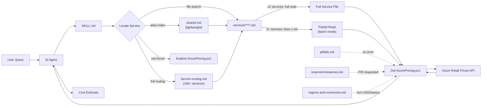

# Azure Cost Calculator — AI Agent Skill

An AI coding agent skill that estimates Azure resource costs using **live pricing data** from the [Azure Retail Prices API](https://learn.microsoft.com/en-us/rest/api/cost-management/retail-prices/azure-retail-prices). Compatible with 35+ agents that support the [skills.sh](https://skills.sh) ecosystem, including [GitHub Copilot](https://docs.github.com/en/copilot/customizing-copilot/copilot-extensions/building-copilot-skills), [Claude Code](https://claude.ai), [Cursor](https://cursor.sh), and [Windsurf](https://windsurf.com).

No guessing, no stale spreadsheets — just real-time price lookups and clear cost breakdowns.

## Supported Services (140+ mapped)

18 categories covering the full breadth of Azure. Services with reference files have fully documented query patterns; all others are routable via the [service routing map](skills/azure-cost-calculator/references/service-routing.md).

| Category            | Example Services                                                                   |
| ------------------- | ---------------------------------------------------------------------------------- |
| **Compute**         | Virtual Machines, App Service, Azure Functions, Container Apps, AKS, Batch         |
| **Containers**      | Container Instances, Container Registry                                            |
| **Databases**       | SQL Database, Cosmos DB, PostgreSQL Flexible Server, Redis Cache, MySQL, MariaDB   |
| **Networking**      | Application Gateway, Azure Firewall, Load Balancer, VPN Gateway, Private Link, DNS |
| **Storage**         | Blob / File / Queue / Table Storage, Managed Disks, NetApp Files, Data Box         |
| **Security**        | Key Vault, Defender for Cloud, Purview, Confidential Ledger, HSMs                  |
| **Monitoring**      | Azure Monitor, Application Insights, Log Analytics                                 |
| **Management**      | Sentinel, Automation, Site Recovery, Azure Arc, Migrate, Cost Management           |
| **Integration**     | API Management, Service Bus, Logic Apps, Event Grid                                |
| **Analytics**       | Synapse Analytics, Data Factory, Databricks, Data Explorer, HDInsight, Fabric      |
| **AI + ML**         | Azure OpenAI, Azure ML, AI Services, Bot Service, Foundry Models                   |
| **IoT**             | IoT Hub, IoT Central, Event Hubs, Digital Twins, Azure Maps                        |
| **Developer Tools** | App Configuration, DevTest Labs, Dev Box, Load Testing, Grafana                    |
| **Identity**        | Entra ID, Entra Domain Services, Azure AD B2C, External Identities                 |
| **Migration**       | Database Migration Service, Azure Migrate                                          |
| **Web**             | Azure AI Search, Static Web Apps, Spring Apps                                      |
| **Communication**   | ACS Voice, SMS, Email, Phone Numbers, Packet Core                                  |
| **Specialist**      | Azure Quantum, Remote Rendering, FHIR API, Copilot Studio, Stack Edge              |

## Installation

### Via skills.sh (any agent)

```bash
npx skills add ahmadabdalla/azure-cost-calculator-skill
```

### Via agent chat

Some agents support installing skills directly from the chat interface:

```
install skill ahmadabdalla/azure-cost-calculator-skill
```

Refer to your agent's documentation for the exact install command syntax.

### Manual install

Point your agent's configuration to the skill entry point at `skills/azure-cost-calculator/SKILL.md` in this repository. For example, clone the repo and add the path to your agent's skill or instruction configuration.

## Usage

Once installed, just ask your AI agent about Azure costs in natural language. The skill automatically activates when it detects pricing-related questions.

### Example prompts

```
How much does a D4s v5 VM cost per month in East US?
```

```
Compare App Service pricing tiers for a production web app
```

```
Estimate the monthly cost of a Standard_B2s VM with a P30 managed disk in Australia East in AUD
```

```
What's the cost of a General Purpose SQL Database with 4 vCores in West Europe in EUR?
```

```
Budget a Kubernetes cluster with 3 D4s v5 nodes in Canada Central
```

```
How much would Azure Cosmos DB with 1000 RU/s and 100 GB storage cost?
```

### Sample interaction

**You:** _How much does a Standard_D4s_v5 VM cost per month in East US?_

**Agent:** Queries the live Azure Retail Prices API and returns:

> **Azure VM Cost Estimate — Standard_D4s_v5 (East US)**
>
> | Item         | Value           |
> | ------------ | --------------- |
> | SKU          | Standard_D4s_v5 |
> | Region       | eastus          |
> | OS           | Linux           |
> | Unit Price   | $0.192 /hour    |
> | Monthly Cost | **$140.16**     |
>
> **Assumptions:** Pay-as-you-go pricing, Linux OS, 730 hours/month, no reserved instances.

## Architecture



References are loaded on demand — only `SKILL.md` and `shared.md` load on every query. All other references load conditionally, keeping token consumption low for multi-service estimates.

## How It Works

The skill uses the **filesystem as an index** — each supported Azure service has a dedicated reference file under `skills/azure-cost-calculator/references/services/` organized into 18 categories. These files contain the exact API filter values, cost formulas, and known traps for each service.

1. **Identifies** the Azure resource type(s) from your question
2. **Locates** the matching service reference file via file search, the [common alias index](skills/azure-cost-calculator/references/shared.md) (~40 most-searched services), or the [full routing map](skills/azure-cost-calculator/references/service-routing.md) (160+ services)
3. **Reads** the service file — in full for 1–2 services, or lines 1–45 only in **batch estimation mode** (3+ services) for token efficiency
4. **Runs** `Get-AzurePricing.ps1` which calls the [Azure Retail Prices REST API](https://learn.microsoft.com/en-us/rest/api/cost-management/retail-prices/azure-retail-prices)
5. **Presents** a structured estimate with unit price, monthly cost, and stated assumptions

### Token-efficient design

The skill is designed for complex multi-service estimates (10–15+ services) without exhausting the agent's context window:

- **Lazy reference loading** — only `SKILL.md` and `shared.md` load on every query. Troubleshooting ([pitfalls.md](skills/azure-cost-calculator/references/pitfalls.md)), RI pricing ([reserved-instances.md](skills/azure-cost-calculator/references/reserved-instances.md)), region/currency info ([regions-and-currencies.md](skills/azure-cost-calculator/references/regions-and-currencies.md)), and the full routing map ([service-routing.md](skills/azure-cost-calculator/references/service-routing.md)) load only when needed.
- **Batch estimation mode** — for 3+ services, the agent reads only the first 45 lines of each service file (metadata + primary query pattern), reducing per-service token cost by ~65%.
- **Alias-first routing** — a compact alias index in `shared.md` resolves common service names without loading the full 140+ service routing map.

For services **not yet documented**, `Explore-AzurePricing.ps1` discovers available filter values directly from the API.

All prices come directly from Microsoft's public API — no hardcoded values.

## Features

- **Live pricing** — always queries the Azure Retail Prices API at runtime
- **Multi-currency** — supports USD, AUD, EUR, GBP, JPY, CAD, INR, and more
- **All regions** — works with any Azure region
- **Comparison mode** — compare SKUs, tiers, or regions side-by-side
- **Transparent assumptions** — every estimate states region, OS, commitment type, and instance count
- **Exploration script** — includes `Explore-AzurePricing.ps1` for discovering available SKUs and pricing options

## Prerequisites

- **PowerShell 5.1+** (pre-installed on Windows; available on macOS/Linux via [PowerShell Core](https://learn.microsoft.com/en-us/powershell/scripting/install/installing-powershell))
- **Internet access** to reach `https://prices.azure.com`
- No Azure subscription or authentication required — the Retail Prices API is public

## Contributing

Contributions are welcome! If you'd like to add support for a new Azure service or improve an existing one:

1. Fork this repository
2. Add or update the service reference in `skills/azure-cost-calculator/references/services/<category>/` using [TEMPLATE.md](skills/azure-cost-calculator/references/services/TEMPLATE.md) as a starting point
3. **45-line rule**: ensure the first query pattern (most common configuration) appears within the first 45 lines — this is required for batch estimation mode
4. Place the file in the category specified in [service-routing.md](skills/azure-cost-calculator/references/service-routing.md)
5. If adding a new category, update the category index in [shared.md](skills/azure-cost-calculator/references/shared.md)
6. Submit a pull request

## License

This project is licensed under the [MIT License](LICENSE).
