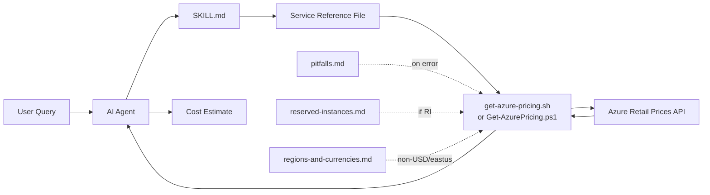

# Azure Cost Calculator — AI Agent Skill

Real-time Azure cost estimation using the public [Azure Retail Prices API](https://learn.microsoft.com/en-us/rest/api/cost-management/retail-prices/azure-retail-prices). Works with any agent in the [skills.sh](https://skills.sh) ecosystem. No guessing, no stale data — deterministic price lookups from the live API. No Azure subscription required.

## Install

```bash
npx skills add ahmadabdalla/azure-cost-calculator-skill
```

> **Don't have `npx`?** Install [Node.js](https://nodejs.org/) (which includes `npm` and `npx`), or run `npm install -g skills` first then use `skills add ahmadabdalla/azure-cost-calculator-skill`.

The CLI auto-detects your agent (Claude Code, Cursor, GitHub Copilot, Codex, etc.) and installs the skill to the correct directory.

## Usage

Ask about Azure costs in natural language. The skill activates automatically.

```
How much does a D4s v5 VM cost per month in East US?
Compare App Service pricing tiers for a production web app
Estimate a Standard_B2s VM with a P30 managed disk in Australia East in AUD
What's the cost of a General Purpose SQL Database with 4 vCores in West Europe in EUR?
How much would Azure Cosmos DB with 1000 RU/s and 100 GB storage cost?
```

## How It Works

The skill uses service reference files as an index. Each file contains exact API filter values as declarative `Key: Value` parameters, cost formulas, and traps. The agent locates the right file, translates the parameters to the detected runtime (Bash or PowerShell), runs the pricing script against the live API, and presents a structured estimate.

- **Deterministic** — same query → same API call → same price. All values from the live API, nothing hardcoded.
- **Token-efficient** — only SKILL.md and shared.md load on every query. Service files load on demand. Batch mode (3+ services) reads only the first 45 lines per file.
- **Multi-currency, all regions** — supports USD, AUD, EUR, GBP, JPY, CAD, INR, etc. Works with any Azure region.



References load on demand — keeping token consumption low even for 10+ service estimates.

## Supported Services

140+ Azure services are mapped across 18 categories (Compute, Databases, Networking, Storage, Security, Monitoring, Integration, AI + ML, and more). ~25+ services have full reference files with documented query patterns. For services without reference files, `Explore-AzurePricing.ps1` discovers filter values directly from the API.

### With vs. Without a Service Reference File

The skill works for **any** Azure service — with or without a reference file. Reference files just make it better:

|                      | With reference file                                               | Without (discovery mode)                                                            |
| -------------------- | ----------------------------------------------------------------- | ----------------------------------------------------------------------------------- |
| **API query**        | Pre-verified filters, ready to go                                 | Agent discovers filters from the live API                                           |
| **Known gotchas**    | Documented — the agent avoids common pricing quirks automatically | Agent still works, but may not catch edge cases like $0.00 rounding or RI math      |
| **Multi-part costs** | Each component (compute, storage, IP, etc.) has its own query     | Agent queries the main component; secondary costs may need a follow-up              |
| **Cost formula**     | Correct multipliers, free-tier deductions, tiered pricing         | Uses the API's unit of measure — usually right, occasionally off for unusual meters |
| **Speed**            | Fast — minimal tokens                                             | A bit slower — runs a discovery step first                                          |
| **Accuracy**         | High — patterns tested against the live API                       | Good — but the agent flags the estimate for manual verification                     |

### Found a Gap? Open an Issue

If you query a service and the skill falls back to discovery mode, that's a signal we're missing a reference file. **Please [open an issue](../../issues/new)** with the service name rather than accepting the best-effort result. Even if the estimate looked correct this time, the next user (or the next API change) may not be so lucky. Issues help us prioritise which reference files to add next.

## Prerequisites

- **Bash** with `curl` and `jq` (macOS/Linux — preferred), **or** PowerShell 5.1+ ([install on macOS/Linux](https://learn.microsoft.com/en-us/powershell/scripting/install/installing-powershell))
- Internet access to `https://prices.azure.com`
- No Azure subscription or authentication required

## Contributing

See [CONTRIBUTING.md](CONTRIBUTING.md) for the full guide. In short:

- Add service files under `skills/azure-cost-calculator/references/services/<category>/` using the [template](skills/azure-cost-calculator/references/services/TEMPLATE.md)
- First query pattern must appear within lines 1–45 (required for batch mode)
- Run the validation script before submitting: `pwsh skills/azure-cost-calculator/scripts/Validate-ServiceReference.ps1`

## License

This project is licensed under the [MIT License](LICENSE).

## Support

If you find this skill useful, consider buying me a coffee:

<a href="https://www.buymeacoffee.com/ahmadabdalla" target="_blank"></a>
