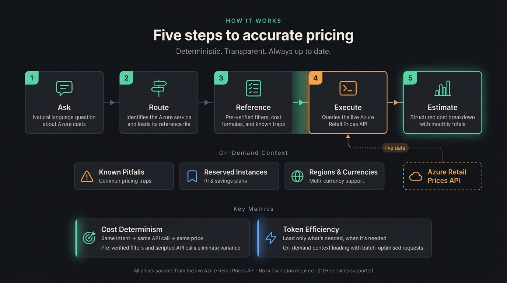

# Azure Cost Calculator - AI Agent Plugin

Real-time Azure cost estimation using the public [Azure Retail Prices API](https://learn.microsoft.com/en-us/rest/api/cost-management/retail-prices/azure-retail-prices). Works with any agent in the [skills.sh](https://skills.sh) ecosystem. All prices come from live API lookups. No Azure subscription required.

## Install

### Install as a Plugin (recommended for Copilot CLI and Claude Code)

> Run inside a Copilot CLI or Claude Code session.

```bash
/plugin marketplace add ahmadabdalla/plugins
/plugin install azure-cost-calculator@ahmadabdalla-plugins
```

> Plugin install pulls from versioned releases with changelog tracking and update control. For the full plugin install/uninstall/update guide, see [Plugin Management](docs/plugin-management.md).

### Install as a Skill (works with any agent)

**npx** (works with any agent):

```bash
npx skills add ahmadabdalla/azure-cost-calculator-skill
```

> **Don't have `npx`?** Install [Node.js](https://nodejs.org/) (which includes `npm` and `npx`), or run `npm install -g skills` first then use `skills add ahmadabdalla/azure-cost-calculator-skill`.

> The npx method pulls the latest from the `main` branch directly — it always gets the current stable content but without version pinning or rollback.

## Usage

Ask about Azure costs in natural language — the skill activates automatically. No configuration needed.

<details open>
<summary><strong>🟢 Quick Price Checks</strong> — just ask</summary>

<br>

The simplest way to use the skill. Ask any Azure pricing question as you normally would:

```
How much does a D4s v5 VM cost per month in East US?
What's the cheapest option for a managed PostgreSQL database?
Estimate a Standard_B2s VM with a P30 managed disk in Australia East in AUD
```

Not sure where to start?

```
I'm planning an Azure deployment — what should I think about for cost estimation?
```

The agent walks you through the key parameters that affect pricing accuracy.

</details>

<details>
<summary><strong>🔵 Comparing & Combining Services</strong> — get specific</summary>

<br>

Compare tiers, combine multiple services, or estimate in any currency and region:

```
Compare App Service Basic vs Standard vs Premium for a production web app
What's the cost of a General Purpose SQL Database with 4 vCores in West Europe in EUR?
How much would Azure Cosmos DB with 1000 RU/s and 100 GB storage cost?
Estimate 3 D4s_v5 VMs with P30 disks and a Standard load balancer in UK South in GBP
```

You can also use the **slash command** or **agent** for direct estimates:

| Platform        | Example                                                                       |
| --------------- | ----------------------------------------------------------------------------- |
| **Claude Code** | `/estimate-cost 2x Standard_B2s Linux VMs with P30 disks in East US`          |
| **Copilot CLI** | `@cost-analyst estimate 2x Standard_B2s Linux VMs with P30 disks in East US`  |

</details>

<details>
<summary><strong>🟣 Full Architecture Analysis</strong> — estimate complete deployments</summary>

<br>

For larger architectures, describe your setup inline or point to a file.

**Inline — natural language:**

```
I'd like a cost analysis on this Azure architecture:

  Web Tier:  2× D2s_v5 Linux VMs with P30 disks
  App Tier:  2× D4s_v5 Linux VMs with P30 disks
  Data Tier: 1× SQL Managed Instance, General Purpose, 8 vCores, 256 GB

  Region: East US | Currency: USD | Commitment: Pay-As-You-Go
```

**File reference — point to a markdown file with your architecture:**

| Platform        | Example                             |
| --------------- | ----------------------------------- |
| **Claude Code** | `/estimate-cost @arch.md`           |
| **Copilot CLI** | `@cost-analyst estimate @arch.md`   |

**Ready-to-use examples** — these architecture files are included with the skill and demonstrate well-specified prompts that produce consistent results:

| Example | Services |
| ------- | -------- |
| [3-Tier Web App](skills/azure-cost-calculator/references/examples/3-tier-web-app.md) | VMs, Managed Disks, SQL MI |
| [Event-Driven Serverless](skills/azure-cost-calculator/references/examples/event-driven-serverless.md) | Functions, Event Grid, Service Bus, Cosmos DB, Sentinel |
| [Data Analytics Platform](skills/azure-cost-calculator/references/examples/data-analytics-platform.md) | Databricks, Synapse, Event Hubs, Data Lake, VMs |
| [Security & Observability](skills/azure-cost-calculator/references/examples/security-observability-platform.md) | Sentinel, Firewall, DDoS, Front Door WAF, Key Vault |

Copy any example, modify it for your environment, and pass it to the agent. For tips on writing prompts that minimise cost variance, see the [Usage Guide](skills/azure-cost-calculator/USAGE.md).

</details>

## How It Works

The skill uses service reference files as an index. Each file contains exact API filter values as declarative `Key: Value` parameters, cost formulas, and traps. The agent reads the matching file, translates the parameters to the detected runtime (Bash or PowerShell), runs the pricing script against the live API, and presents a structured estimate.

The skill optimises for two goals:

- **Determinism** - target ≤ 5% cost variance. Same query → same API call → same price. All values from the live API, nothing hardcoded. LLMs are non-deterministic by nature, so this skill is designed to constrain them where possible: pre-verified filters, explicit formulas, and scripted API calls reduce the surface area where the model can drift.
- **Token efficiency** - target ≤ 5% token usage variance. Only SKILL.md and shared.md load on every query. Service files load on demand. Batch mode (3+ services) reads only the first 45 lines per file.

Other design goals:

- **Multi-currency, all regions** - supports USD, AUD, EUR, GBP, JPY, CAD, INR, etc. Works with any Azure region.

> **Note:** Targets measured via A/B testing with clean-context sessions against complex Azure architectures. Tested with **Claude Opus 4.6** and **Gemini Pro 3**. Results with other models may vary.

<p align="center">
  
</p>

References load on demand, keeping token usage low even for 10+ service estimates.

## Supported Services

210+ Azure services are mapped across 18 categories (Compute, Databases, Networking, Storage, Security, Monitoring, Integration, AI + ML, and more). 110+ services have full reference files with documented query patterns. For services without a reference file, the skill includes an exploration script that searches the live API to find the right filters automatically.

### Found a Gap? Open an Issue

If you query a service and the skill falls back to discovery mode, that's a signal we're missing a reference file. **Please [open an issue](../../issues/new)** with the service name rather than accepting the best-effort result. Even if the estimate looked correct this time, the next user (or the next API change) may not get the same result. Issues help us prioritise which reference files to add next.

## Prerequisites

- **Bash** with `curl` and `jq` (macOS/Linux, preferred), **or** **PowerShell 7+** (`pwsh`) — [install on Windows/macOS/Linux](https://learn.microsoft.com/en-us/powershell/scripting/install/installing-powershell). Windows ships with PowerShell 5.1 (`powershell.exe`) which is **not** the same as `pwsh`; you must install PowerShell 7 separately.
- Internet access to `https://prices.azure.com`
- No Azure subscription or authentication required

## Contributing

Each service reference file you add improves accuracy for everyone. See [CONTRIBUTING.md](CONTRIBUTING.md) for the full guide, including a ready-to-use prompt that walks your AI through generating a complete reference file.

## FAQ

<details>
<summary><strong>Why is this free?</strong></summary>

1. **The API is free.** The [Azure Retail Prices API](https://learn.microsoft.com/en-us/rest/api/cost-management/retail-prices/azure-retail-prices) is public and requires no authentication or Azure subscription.
2. **We can't guarantee determinism.** LLMs are non-deterministic by nature. While this skill constrains the model for consistency, we can't commit to identical results for identical prompts, and we don't think it's right to charge for something we can't make fully deterministic.
3. **Community-driven by design.** Some things are meant to be open source because they rely on community support to grow. This project is one of them, and every service reference file contributed improves accuracy for everyone.

</details>

<details>
<summary><strong>Why contribute service references?</strong></summary>

Without a reference file the agent still works, but it has to discover API filter values on the fly, using more tokens and risking inconsistent results. A reference file provides pre-verified query patterns, documented traps, and correct cost formulas, so every user gets consistent results.

|                      | With reference file                                               | Without (discovery mode)                                                            |
| -------------------- | ----------------------------------------------------------------- | ----------------------------------------------------------------------------------- |
| **API query**        | Pre-verified filters                                              | Agent discovers filters from the live API                                           |
| **Known gotchas**    | Documented - the agent avoids common pricing quirks automatically | Agent still works, but may not catch edge cases like $0.00 rounding or RI math      |
| **Multi-part costs** | Each component (compute, storage, IP, etc.) has its own query     | Agent queries the main component; secondary costs may need a follow-up              |
| **Cost formula**     | Correct multipliers, free-tier deductions, tiered pricing         | Uses the API's unit of measure - usually right, occasionally off for unusual meters |
| **Speed**            | Fast - fewer tokens                                               | Slower - requires a discovery step first                                            |
| **Accuracy**         | High - patterns tested against the live API                       | Depends on model quality - may vary without pre-verified patterns                   |

</details>

<details>
<summary><strong>Should I install as a global or project skill?</strong></summary>

Global installs the skill once and makes it available across all your projects without duplicating files. Project-scoped installs it inside a single project. Use global if you estimate Azure costs regularly; use project if you only need it for a specific repo.

</details>

## License

This project is licensed under the [MIT License](LICENSE).

## Support

If you find this skill useful, consider buying me a coffee:

<a href="https://www.buymeacoffee.com/ahmadabdalla" target="_blank"></a>
